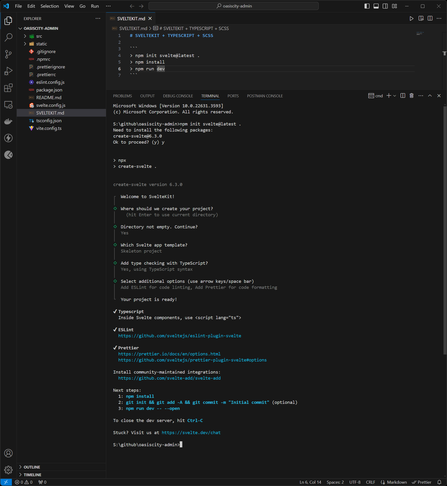

# SVELTEKIT + TYPESCRIPT + SCSS

```
> npm init svelte@latest .
> npm install
> npm run dev
```



```
> npm install -D svelte-preprocess sass
> npm install
> npm run dev -- --open
```

# NETLIFY

```
> npm install -D @sveltejs/adapter-netlify@next
```

### svelte.config.js

```javascript
//import adapter from '@sveltejs/adapter-auto';
import { vitePreprocess } from '@sveltejs/kit/vite';
import adapter from '@sveltejs/adapter-netlify';

/** @type {import('@sveltejs/kit').Config} */
const config = {
	// Consult https://kit.svelte.dev/docs/integrations#preprocessors
	// for more information about preprocessors
	preprocess: vitePreprocess(),

	kit: {
		// adapter-auto only supports some environments, see https://kit.svelte.dev/docs/adapter-auto for a list.
		// If your environment is not supported or you settled on a specific environment, switch out the adapter.
		// See https://kit.svelte.dev/docs/adapters for more information about adapters.
		adapter: adapter()
	}
};

export default config;
```

#### netlify.toml

```
[build]
  command = "npm run build"
  publish = "build"
```
